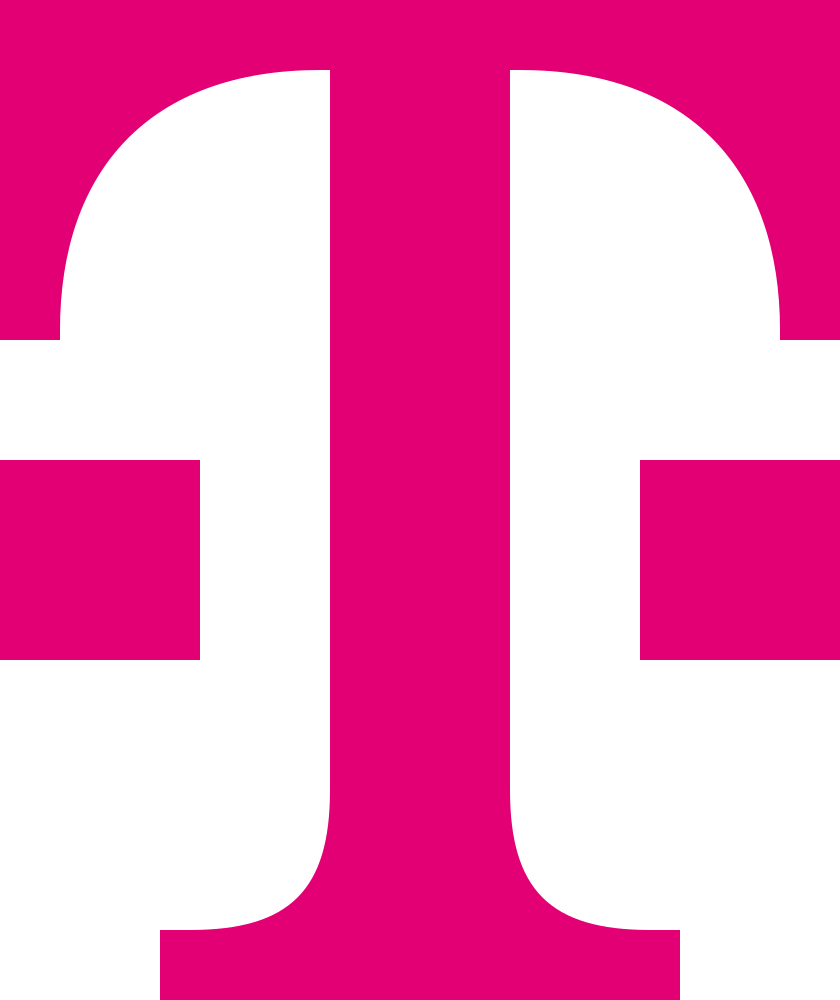

# Telekom 8ra Open Source

This organization hosts Deutsche Telekom’s open-source contributions to the 8ra Initiative and its core IPCEI‑CIS programme, focusing on sovereign, federated cloud‑edge infrastructure and developer tooling.

8ra is Europe’s large-scale effort to build a sovereign, interoperable Multi‑Provider Cloud‑Edge Continuum. IPCEI‑CIS (Important Project of Common European Interest on Next Generation Cloud Infrastructure and Services) is the core funding and collaboration framework that makes this vision concrete across industry and research partners.

## Scope

This space will collect:

- Building blocks for sovereign cloud‑edge infrastructure.
- Federation and interconnection capabilities across cloud, edge and telco environments.
- Orchestration, scheduling, and sustainability components.
- Open APIs, SDKs, examples, tutorials, and reference solutions.

## Status

🚧We are in the process of publishing and structuring our artefacts.  
This space will be updated progressively with the full set of capabilities, documentation, and contribution guidelines.🚧

For now, please watch this organization for updates or check back soon.

## Further information

- 8ra Initiative overview: https://www.8ra.com[web:118][web:142]  
- IPCEI‑CIS description: https://www.8ra.com/ipcei-cis/[web:80]  

## :blue_heart: Code of Conduct

To facilitate an open and welcome environment for all, check out the [Linux Foundation Code of Conduct](https://events.linuxfoundation.org/about/code-of-conduct/).

  

